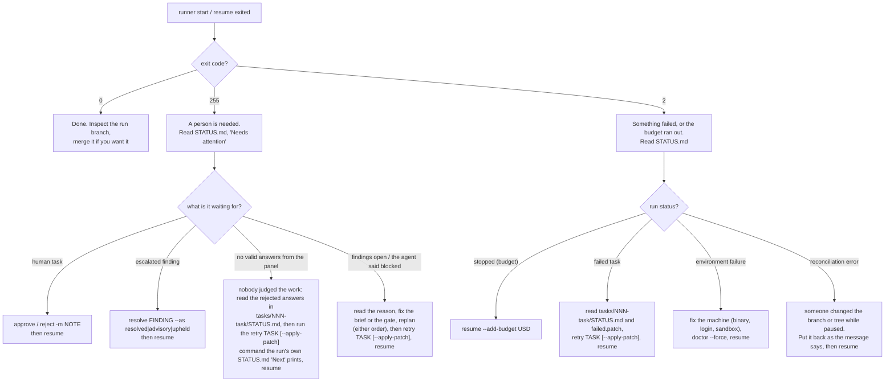

# Runbook

Status: **partly verified at stage 6**. The [stage 4 CLI walkthrough](stage-4-walkthrough.md)
exercises qualification, preflight and human tasks. The [stage 5 walkthrough](stage-5-walkthrough.md)
exercises panels, rework and `resolve`; tests cover budget pauses, retry, branch safety and parallel
process cleanup. The [stage 6 walkthrough](stage-6-walkthrough.md) verifies replan and reopening.

For the ideas behind these procedures, read the [tutorial](tutorial/README.md).

## The decision chart



## 0. Choose where the record goes

> [!IMPORTANT]
> **`--runs-dir DIR` decides where every run's artifacts are kept.** Without it the record is the
> hidden `.runs/` at the top of the repository. With it, each run gets its own directory
> `DIR/<workflow>/<workflow>-<UTC start>-<uuid8>/`: a meaningful name plus the run's UUID prefix,
> matching its branch `run/<workflow>-<uuid8>`. The option goes **before** the command and is
> relative to the current directory:
>
> ```sh
> runner --runs-dir runs start tr/spsc-queue.toml
> runner --runs-dir runs status
> runner --runs-dir runs resume
> ```
>
> The location is not remembered. **Every** later command on those runs (`status`, `activity`,
> `runs`, `resume`, `approve`, `reject`, `resolve`, `retry`, `replan`, `prune`, and `doctor`, whose
> cache lives there) needs the same `--runs-dir`, or it answers `no runs directory …`. To avoid
> repeating it, export `TASK_RUNNER_RUNS_DIR=runs` (relative to the top of the repository) or wrap
> the runner in a project script that always passes the option. The directory writes its own
> `.gitignore`, so it never dirties the tree; listing it in the project's `.gitignore` as well is harmless and
> makes the intent visible.

Wherever this runbook says `.runs/`, read: the directory you chose.

## 1. Before the first run — verified at stage 4

1. `runner validate WORKFLOW`. Fix every error. Read the warnings and the expanded DAG; check that
   each claim of a frozen file is intended.
2. `runner graph WORKFLOW -o wf.dot` if you want to look at the shape.
3. `runner doctor WORKFLOW`. Qualifies each agent profile per capability. It costs a little money
   and is cached.
4. `runner check-gates WORKFLOW` uses disposable copies of the clean repository. Every `new` gate should report **fail**, for the intended reason.
   A `new` gate that passes cannot show the task was done. A gate that leaves files behind must be
   fixed, or its products ignored by git.
5. Make sure the work tree is clean. There is no option to start dirty.

## 2. Starting and watching a run — verified at stage 3

- `runner [--runs-dir DIR] start WORKFLOW` creates a run directory
  `<workflow>-<UTC start>-<uuid8>` (see section 0), checks out `run/<workflow>-<uuid8>`, and works until it is
  done or needs something.
- While it runs, use `runner activity latest --tail 20` for recent agent tool/hook events. See
  [headless observability](headless-observability.md) for provenance and missing-event limitations.
- While it runs, read `.runs/<workflow>/<run>/STATUS.md`. It is regenerated on every state change,
  and a working runner also refreshes it about every 30 seconds: the **In flight** section lists each
  agent call and command that has begun, when it started and how long it has been running, with
  an "As of" time. An old "As of" time means no runner is working on the run (it was stopped or
  killed): `runner resume`.
- **Do not edit the work tree or the run branch while a run is active or paused.** `resume` will
  refuse to continue if you did.

## 3. Stops that need you — verified through stage 6

| STATUS.md says | Do |
|---|---|
| waiting for approval of TASK | Review the candidate in the work tree. `runner approve RUN TASK` or `runner reject RUN TASK -m "why"`. Then `resume` |
| finding X is escalated | Read both sides in `findings.json`. `runner resolve RUN X --as resolved\|advisory\|upheld -m "why"`. Then `resume` |
| TASK is blocked: the agent said … | The brief, the inputs or a gate is wrong. Fix the workflow, then, in either order, `runner replan RUN` and `runner retry RUN TASK --apply-patch` to keep the set-aside work (`runner retry RUN TASK` starts clean instead; nothing at all is needed once a replan has already reset the task to pending). Then `runner resume RUN` |
| TASK is blocked: attempts ran out with findings open | Read the findings. Either settle them yourself, then `runner retry RUN TASK --apply-patch`, or change the brief and `runner retry RUN TASK` to start clean. Then `runner resume RUN` |
| TASK is blocked: the reviewers could not answer in the required form | Nobody judged the work. Read the rejected answers in `tasks/NNN-task/STATUS.md`, then run the exact `runner retry RUN TASK …` command the **run's** `<run>/STATUS.md` "Next" section prints — `--apply-patch` when there is set-aside work to put back, plain `retry` when the attempt changed nothing. Then `resume` |
| TASK is blocked: one reviewer could not answer in the required form and another did not finish | One reviewer's answers were rejected and are summarised in `tasks/NNN-task/STATUS.md`; the other's own cause (a timeout, an error, an interruption) is named beside it. Read both, then run the exact `runner retry RUN TASK …` command the **run's** `<run>/STATUS.md` "Next" section prints — `--apply-patch` when there is set-aside work to put back, plain `retry` otherwise. Then `resume` |
| stopped: out of budget | `runner resume RUN --add-budget 20` |

## 4. Failures — to verify at stages 2 and 3

| Situation | Do |
|---|---|
| A task failed | Its work is in `tasks/NNN-task/failed.patch`, and the tree is back at the last accepted state. Read the last attempt's `gate.log`. `runner retry RUN TASK` to start clean, or `runner retry RUN TASK --apply-patch` to continue from the failed work — a commit of workflow or brief edits made since the set-aside does not prevent this, but an acceptance since does. Then `runner resume RUN` |
| Environment failure | No producer attempt was used; any reported cost remains in the record. Fix the cause, `runner doctor WORKFLOW --force`, `resume` |
| The runner was killed | `runner resume`. It reconciles first. If an agent from the dead runner is still alive, it refuses; `resume --stop-orphans` stops it |
| Reconciliation error | The message states what was expected and what was found. Restore that, then `resume`. The runner will not guess |

## 5. Changing the plan mid-run — verified at stage 6

- Settle any active producer transaction. Edit and commit the workflow definitions so the tree is
  clean, then `runner replan RUN` (or pass an external revised file with `--workflow FILE`). It shows the difference per task and applies
  what is safe: new tasks, edits to tasks that have not been accepted.
- Changing an accepted task needs `runner replan RUN --reopen TASK`. The runner lists everything
  affected and undoes those commits with **revert commits**, newest first. The branch is never
  reset. If a revert conflicts, it stops and changes nothing further.

## 6. After a run — to verify at stage 2

- The run branch stays checked out. Going back to your branch and merging are your call; the runner
  never pushes or merges.
- `STATUS.md` is written by the runner when its own state changes, and a merge is not one of those
  changes. `runner status RUN` therefore refreshes a **finished** run every time it is asked, and
  the "Next" section then says whether the last accepted commit is in the branch the run came from
  and in that branch's upstream (as last fetched). Opening the file without running `status` shows
  it as of the last refresh.
- `runner runs WORKFLOW` lists runs with status, cost and date.
- To delete a run: remove its directory, then `runner prune` to delete its pinned refs under
  `refs/task-runner/`.
- To have an agent explain a run: give it the run directory's path. `STATUS.md`, `index.json` and
  `.runs/README.md` are written for that reader.

## Where to look

| Question | File |
|---|---|
| What is the run doing, and what does it need? | `<run>/STATUS.md` |
| What exactly was the agent told? | `tasks/NNN-task/attempt-N/prompt.md` |
| What did the agent print? | `…/attempt-N/invocation-N/stdout.log`, `stderr.log` |
| Why did the attempt not pass? | `…/attempt-N/gate.log`, `reverted.json`, the next attempt's `feedback.md` |
| What did review find, and was it fixed? | `tasks/NNN-task/findings.json` |
| What did a rejected reviewer answer say? | `tasks/NNN-task/STATUS.md`, then the `invocation-N/last-message.txt` it names |
| What work is waiting to be put back, and how | `tasks/NNN-task/set-aside.json` |
| What was verified against which candidate? | `…/attempt-N/verification.json` |
| What did it cost? | `run.json`: known, reserved and unpriced spend |
| Everything, in order | `<run>/events.jsonl` |

## Field experience

See [NYSE execution lessons](nyse-execution-lessons.md) for observed failures, recovery
evidence, shipped fixes and proposed resilience regression scenarios.
