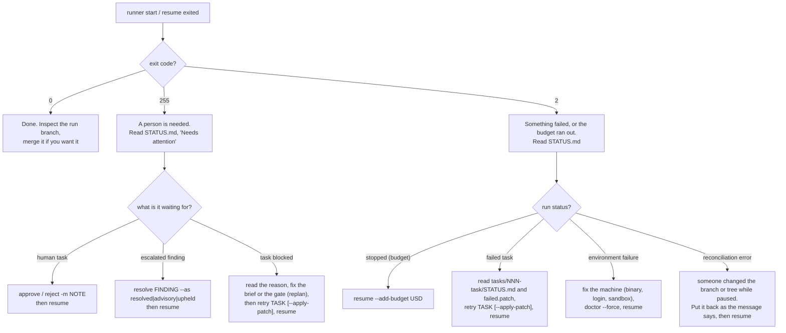

# Runbook

Status: **skeleton**. The procedures below follow the design
([05 — Command line](05-architecture.md#command-line)). No command here has been run yet, because
the program is being built. Each section is marked **to verify at stage N**; at that stage the
commands are run and their real output is pasted in. Output is never written by hand.

For the ideas behind these procedures, read the [tutorial](tutorial/README.md).

## The decision chart

## 1. Before the first run — to verify at stages 1 and 4

1. `runner validate WORKFLOW`. Fix every error. Read the warnings and the expanded DAG; check that
   each claim of a frozen file is intended.
2. `runner graph WORKFLOW -o wf.dot` if you want to look at the shape.
3. `runner doctor WORKFLOW`. Qualifies each agent profile per capability. It costs a little money
   and is cached.
4. `runner check-gates WORKFLOW`. Every `new` gate should report **fail**, for the intended reason.
   A `new` gate that passes cannot show the task was done. A gate that leaves files behind must be
   fixed, or its products ignored by git.
5. Make sure the work tree is clean. There is no option to start dirty.

## 2. Starting and watching a run — to verify at stage 3

- `runner start WORKFLOW` creates a run, checks out `run/<workflow>-<uuid8>`, and works until it is
  done or needs something.
- While it runs, read `.runs/<workflow>/<run>/STATUS.md`; it is regenerated on every state change.
- **Do not edit the work tree or the run branch while a run is active or paused.** `resume` will
  refuse to continue if you did.

## 3. Stops that need you — to verify at stages 3 and 5

| STATUS.md says | Do |
|---|---|
| waiting for approval of TASK | Review the candidate in the work tree. `runner approve RUN TASK` or `runner reject RUN TASK -m "why"`. Then `resume` |
| finding X is escalated | Read both sides in `findings.json`. `runner resolve RUN X --as resolved\|advisory\|upheld -m "why"`. Then `resume` |
| TASK is blocked: the agent said … | The brief, the inputs or a gate is wrong. Fix the workflow, `runner replan RUN`, `runner retry RUN TASK`, `resume` |
| TASK is blocked: attempts ran out with findings open | Read the findings. Either settle them yourself and `retry --apply-patch`, or change the brief and `retry` clean |
| stopped: out of budget | `runner resume RUN --add-budget 20` |

## 4. Failures — to verify at stages 2 and 3

| Situation | Do |
|---|---|
| A task failed | Its work is in `tasks/NNN-task/failed.patch`, and the tree is back at the last accepted state. Read the last attempt's `gate.log`. `retry` clean, or `retry --apply-patch` to continue from the failed work |
| Environment failure | Nothing was charged to any task. Fix the cause, `runner doctor WORKFLOW --force`, `resume` |
| The runner was killed | `runner resume`. It reconciles first. If an agent from the dead runner is still alive, it refuses; `resume --stop-orphans` stops it |
| Reconciliation error | The message states what was expected and what was found. Restore that, then `resume`. The runner will not guess |

## 5. Changing the plan mid-run — to verify at stage 6

- Edit the workflow file, then `runner replan RUN`. It shows the difference per task and applies
  what is safe: new tasks, edits to tasks that have not been accepted.
- Changing an accepted task needs `runner replan RUN --reopen TASK`. The runner lists everything
  affected and undoes those commits with **revert commits**, newest first. The branch is never
  reset. If a revert conflicts, it stops and changes nothing further.

## 6. After a run — to verify at stage 2

- The run branch stays checked out. Going back to your branch and merging are your call; the runner
  never pushes or merges.
- `runner runs WORKFLOW` lists runs with status, cost and date.
- To delete a run: remove its directory, then `runner prune` to delete its pinned refs under
  `refs/task-runner/`.
- To have an agent explain a run: give it the run directory's path. `STATUS.md`, `index.json` and
  `.runs/README.md` are written for that reader.

## Where to look

| Question | File |
|---|---|
| What is the run doing, and what does it need? | `<run>/STATUS.md` |
| What exactly was the agent told? | `tasks/NNN-task/attempt-N/prompt.md` |
| What did the agent print? | `…/attempt-N/invocation-N/stdout.log`, `stderr.log` |
| Why did the attempt not pass? | `…/attempt-N/gate.log`, `reverted.json`, the next attempt's `feedback.md` |
| What did review find, and was it fixed? | `tasks/NNN-task/findings.json` |
| What was verified against which candidate? | `…/attempt-N/verification.json` |
| What did it cost? | `run.json`: known, reserved and unpriced spend |
| Everything, in order | `<run>/events.jsonl` |
