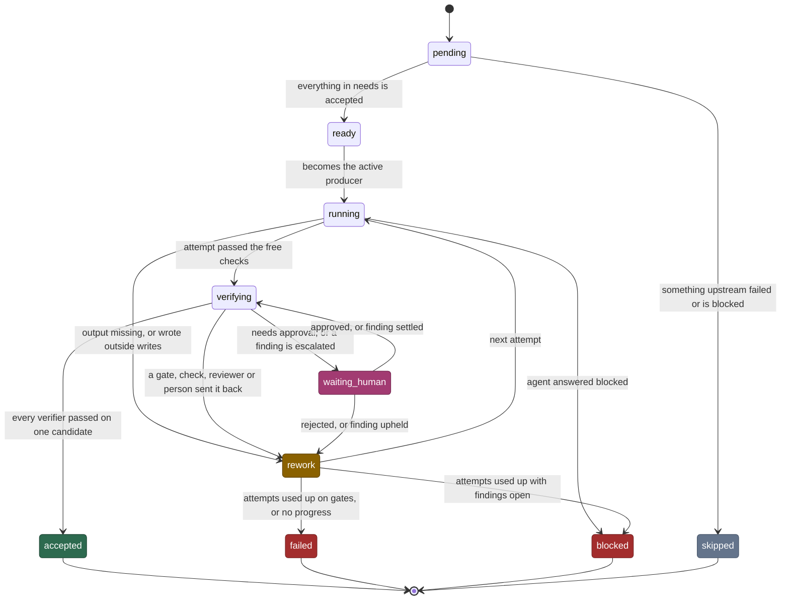
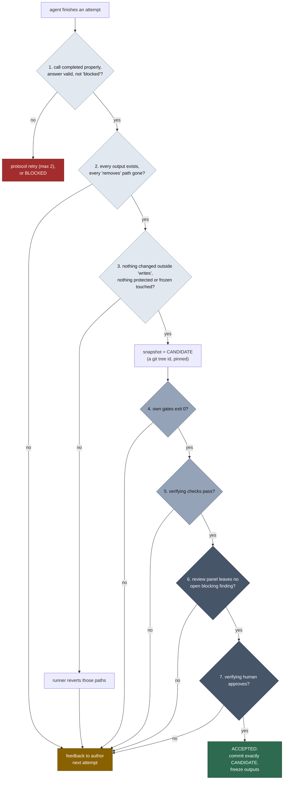
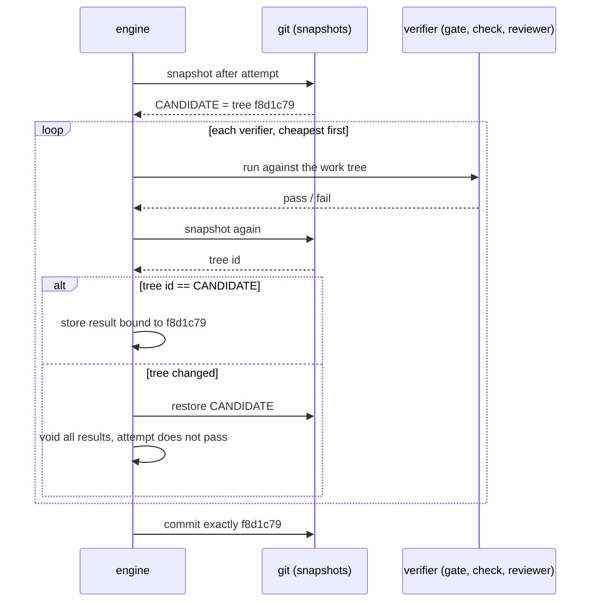
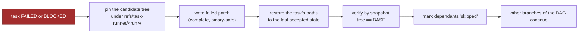

# 2 — A task, end to end

> [!NOTE]
> **Status: design, with the stage 3 subset implemented**. Producer transactions, gates, checks,
> human decisions and the command adapter now run; panels, headless adapters and budgets remain
> later-stage work. See the [verified CLI walkthrough](../stage-3-walkthrough.md).

This chapter follows one producer, `implement`, from the moment it becomes ready to the moment its
work is a commit. Everything else in the runner exists to make this path trustworthy.

## The states a task passes through

`failed` means the run could not do it (exit code 2). `blocked` and `waiting_human` mean a person
is needed (exit code 255).

## The acceptance ladder

An attempt climbs a ladder of verifiers, **cheapest first**. The first failure stops the climb and
sends the work back, so money is never spent reviewing work that does not build.

The darker the step, the more it costs: pale steps are free, mid-grey steps cost seconds to
minutes, dark steps cost agent calls or a person's time. A producer must have at least one of steps 4 to 7, or the workflow is rejected when it loads.

## Every result is tied to one candidate

Here is the subtle point. A gate might pass, and then a later check might quietly rewrite a source
file. If the runner committed the tree at that moment, it would commit something no gate ever saw.

So after step 3 the runner records the candidate's tree id, and:

- every gate, check, verdict and approval is stored **with that tree id**;
- after every verifier the runner takes a new snapshot and compares;
- if the tree differs, the runner puts the candidate back, voids the earlier results, and the
  attempt does not pass. The feedback names the command and the files.

Two honest exceptions exist. A check whose job is to change source and put it back, such as a
mutation tester, is marked `restores = true`: the runner restores the candidate itself afterwards,
even if the tool crashed. And a check marked `read_only` may run beside reviewers, but the claim is
verified by snapshot, not believed.

## Rework

A rework is a new **attempt**, in a new numbered directory. The author is told two things:

1. the immediate cause: gate output, check output, rejection note or new findings;
2. every open blocking finding that still needs a response from it.

If the agent supports continuing a session, the rework continues it, which keeps its understanding
and reuses the provider's cache. If not, or after a timeout or crash, a fresh session gets the full
prompt plus the feedback. The rules are the same either way.

Three counters are kept strictly apart:

| Counter | Counts | Limit |
|---|---|---|
| Producer attempts | each time the author runs, whatever sent it back | `max_attempts`, default 3 |
| Review rounds | per reviewer: the first time it sees a candidate is its round 1 | none of its own |
| Protocol retries | a call that ended without a proper result or with an invalid answer | 2 per call |

A protocol retry is a fault of the *call*, not of the work: it never uses an attempt and never
becomes a finding.

**No progress.** The task fails early only when the gate fails the same way **and** the candidate
tree is identical to the previous attempt's. The same error text after a real change is not "no
progress".

## When it goes wrong

Nothing is thrown away. `retry TASK --apply-patch` puts the work back if its base still matches;
without the flag, attempts start clean.

---

| Previous | | Next |
|:--|:-:|--:|
| [1 — The idea](01-the-idea.md) | [Contents](README.md) | [3 — Review panels and findings](03-review-panels-and-findings.md) |

**Reference:** [02 — Concepts, Acceptance and Rework](../02-concepts.md#acceptance-d7),
[05 — Producer lifecycle](../05-architecture.md#producer-lifecycle).
