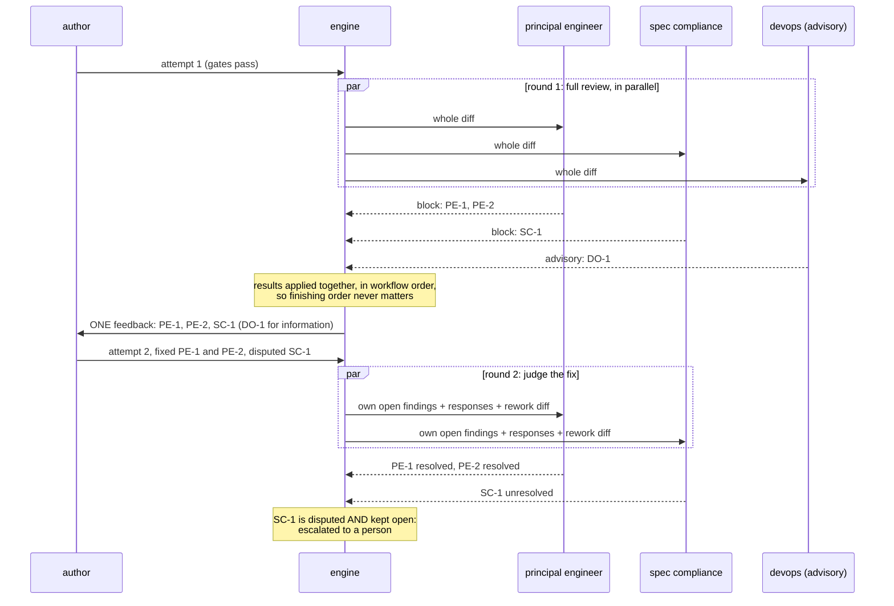
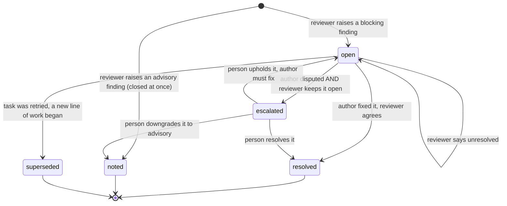
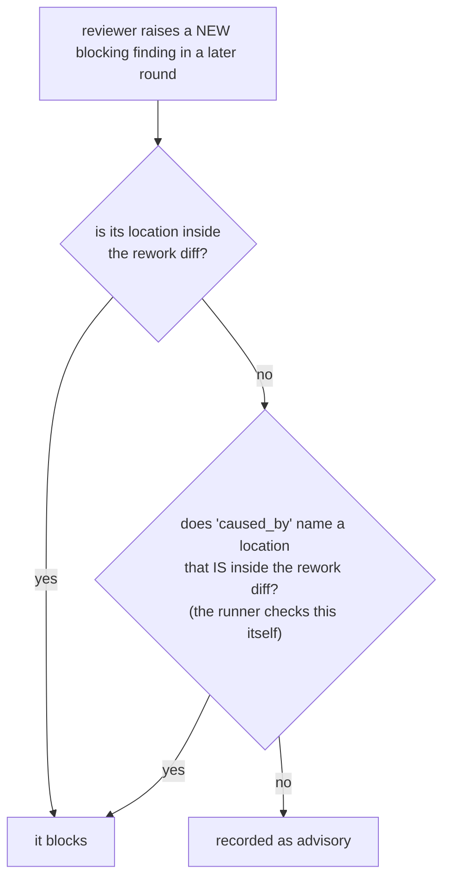
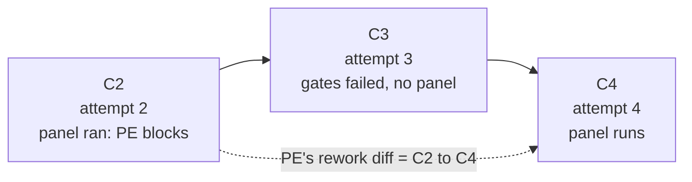

# 3 — Review panels and findings

Status: **design**

Several reviewers on one piece of work is where unattended pipelines usually break: they loop, they
contradict each other, or their objections are "fixed" with nobody checking. This chapter explains
the rules that make a panel converge.

## A panel is a list of personas

```toml
reviewers = ["principal-engineer", "spec-compliance", { perspective = "devops", advisory = true }]
```

Each entry becomes its own review task, run by an agent in a **new, read-only session**, with a
persona that says what to look at, what justifies a blocking finding from that perspective, and
what is **out of scope**. The out-of-scope list matters as much as the focus: it stops five
reviewers raising the same general point.

An **advisory** reviewer can comment but never block.

## The whole panel runs before anything goes back



One consolidated rework instead of one per reviewer: a late objection does not cost several full
loops.

## Findings are tracked, not re-argued

A finding is a record with an id the **runner** assigns, such as `implement/PE-2`: producer,
persona code, number. It is unique in the run and stable across rounds.



Advisory findings never stay open. They are shown to the author for information, need no response,
and no later round is asked about them.

## Later rounds judge the fix, and only the fix

Round 1 is a full review. Without a rule, round 2 would be another full review, and a reviewer
could keep finding new blockers on untouched code for ever. So in a later round:



The second case exists because a rework can change a function and break an unchanged caller. The
reviewer may block on the caller if it names the changed function, and the runner verifies
mechanically that the named location really is in the diff.

**The rework diff is per reviewer.** It runs from the candidate that reviewer last saw to the
current one. If an attempt in between failed its gates and no panel ran, the diff spans that
attempt too, so nothing changed there escapes review.



## The verdict is computed, not believed

The reviewer's answer contains a `verdict` field, but the runner does not use it to decide. After
applying the answer to the ledger, the runner asks one question: *does this reviewer have an open
blocking finding?* An old finding left `unresolved` blocks even if nothing new was raised. If the
model's `verdict` disagrees with the computed one, the answer is invalid and the call is retried as
a protocol error.

This also blunts a whole class of manipulation: a reviewer cannot be talked into "pass" while its
findings are open.

## Disputes go to a person

Two agents disagreeing is not something a third loop settles. When the author answers `disputed`
and the reviewer keeps the finding open, the finding is `escalated`:

- the producer becomes `waiting_human`, with its candidate **still in the work tree**;
- the run stops with exit 255;
- the person runs `resolve FINDING --as resolved|advisory|upheld`, then `resume`.

If the finding no longer blocks, acceptance continues from where it stopped. Every earlier result
is bound to that same candidate, so nothing is repeated and no attempt is used.

## One ledger per producer

Every finding from every reviewer and round, with its history, is in one file:
`tasks/<producer>/findings.json`. "What did review find, and was it fixed?" is answered by reading
it. Because it decides every verdict, it is covered by the record's integrity check from the first
finding on.

Next: [safety: git, the record and recovery](04-safety-git-and-recovery.md).
Reference: [02 — Findings](../02-concepts.md#findings-d5-d15),
[04 — findings.json](../04-run-directory.md#findingsjson-the-ledger).
