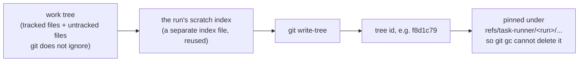
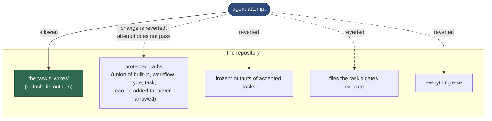
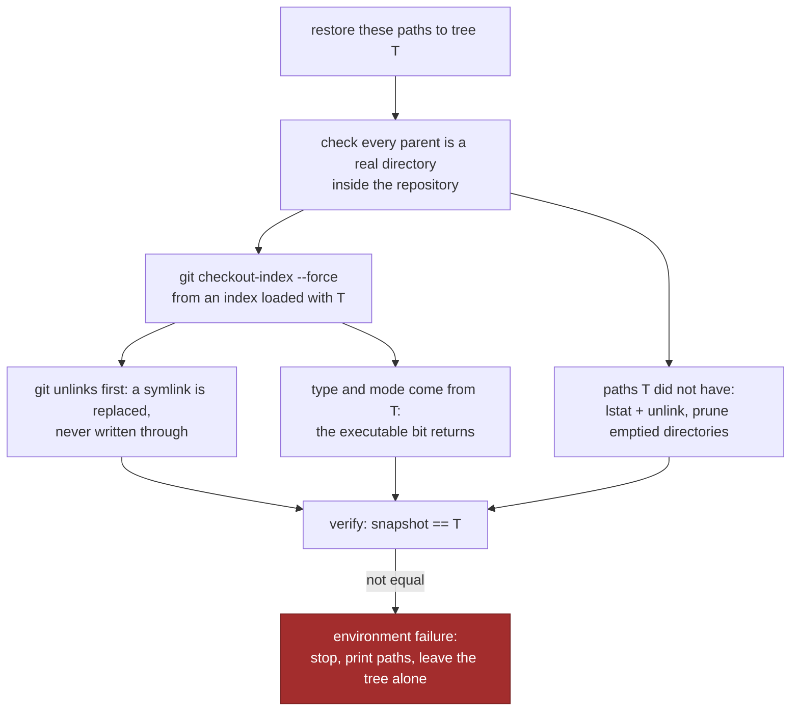
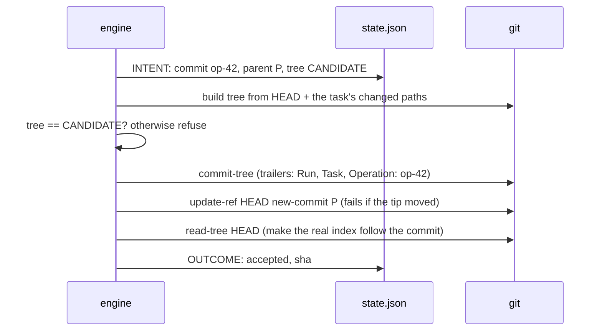
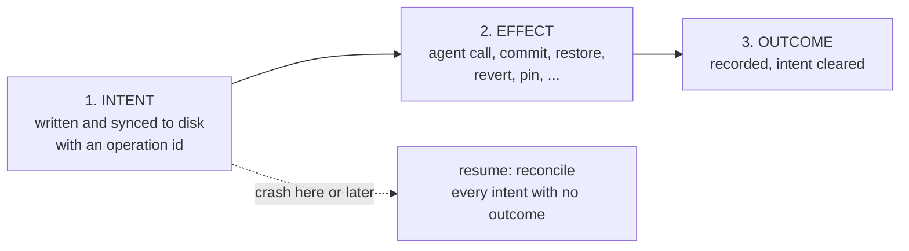

# 4 — Safety: git, the record and recovery

> [!NOTE]
> **Status: partly verified at stage 3.** Snapshots, restore, commit, intent recovery, write protection
> and human pauses are exercised through the engine and the CLI. See the
> [walkthrough](../stage-3-walkthrough.md). Review panels and replan remain design for later stages.

The runner lets agents write to your repository unattended. This chapter explains why that cannot
corrupt it, even when an agent misbehaves, a gate misbehaves, or the machine dies mid-step.

## One primitive: the snapshot

Almost every safety property rests on one operation: **hash the whole work tree into a git tree
id**, without touching your index or your files.

Two trees with the same id are the same content. That turns hard questions into comparisons:

| Question | Answer |
|---|---|
| What did this attempt change? | names that differ between two snapshots |
| Did a gate, a check or a reviewer change anything? | snapshot before == snapshot after? |
| Is the tree clean again after a failure? | snapshot == BASE? |
| Is the commit exactly what was verified? | committed tree == CANDIDATE? |

Because everything rests on git seeing the work, the root **must** be a git repository, declared
paths that git ignores are refused, and `.gitignore`, `.gitattributes` and `.gitmodules` are
protected by default so an agent cannot hide its work from the snapshot.

## What an agent may touch

A later task may change a frozen file only by **claiming** it in its own `writes`, and only if it
depends on the task that made it. `validate` prints every such claim, the claiming task's reviewers
see the diff, and the original task's gates are run again as part of the claimant's verification.

## Restoring files properly

Putting files back sounds trivial and is not. Writing the old bytes over a path follows symbolic
links, which can write **outside the repository**, and loses the executable bit. The runner instead
uses git's own checkout from a separate index loaded with the target tree:

Embedded git repositories and submodule entries, which a restore could not handle, never reach it:
the candidate is scanned right after each attempt and they are removed then.

## Committing exactly what was verified

The last git step matters: without it the index still describes the old tip, `git status` shows
phantom changes, and a later `git revert` refuses to run.

The runner never runs `reset --hard`, `clean`, `stash`, `push` or `merge`. Undoing accepted work
(`replan --reopen`) adds `git revert` commits; it removes none.

## Crashes: intent, effect, outcome

An atomic state file cannot make "run a subprocess, write a commit, update the state" happen
together. So every external effect is bracketed:

| Found on `resume` | Action |
|---|---|
| Commit intent, and the branch tip carries that operation id | It happened. Record acceptance. The author is **not** run again |
| Commit intent, and the tip is still the expected parent | It did not happen. Check the tree still equals the candidate, then commit |
| Commit intent, and the tip is anything else | Someone changed the branch. Stop and say what was expected and found |
| Agent intent, and its process group is still alive | Refuse to continue beside it. `resume --stop-orphans` stops it first |
| Agent intent, no process, no terminal event | Mark it `interrupted`, never successful. New invocation directory |
| Restore, pin, patch, index sync | Idempotent: do it again, verify |
| Half-done revert during `--reopen` | `git revert --abort`, then continue from the first revert not on the branch |

A process is identified by pid, start time **and boot id**, because pids are reused.

## The record protects itself

`.runs/` is ignored by git, so snapshots cannot see an agent tampering with it. The runner keeps
`integrity.json`, the hashes of every decision-bearing file (`state.json`, every `findings.json`,
every finished result, verdict and verification), and checks them before and after every agent call
and every command. A change the runner did not make fails that job.

The path of the record is given only to task types that need it (`summarize`). Gates never get it.

## Pauses hold the tree

Three things stop a run with a producer's candidate still in place: a pending human approval, an
escalated finding, and running out of budget. In each case the runner records the branch tip and
tree it expects, and `resume` checks them first. If someone edited the tree or committed on the
branch meanwhile, `resume` stops with a reconciliation error instead of guessing.

---

| Previous | | Next |
|:--|:-:|--:|
| [3 — Review panels and findings](03-review-panels-and-findings.md) | [Contents](README.md) | [5 — Architecture](05-architecture.md) |

**Reference:** [05 — Git, Crash recovery](../05-architecture.md#git),
[04 — Rules of the record](../04-run-directory.md#rules-of-the-record).
