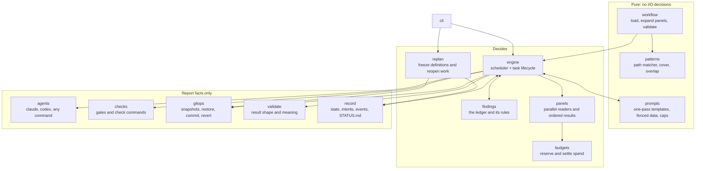
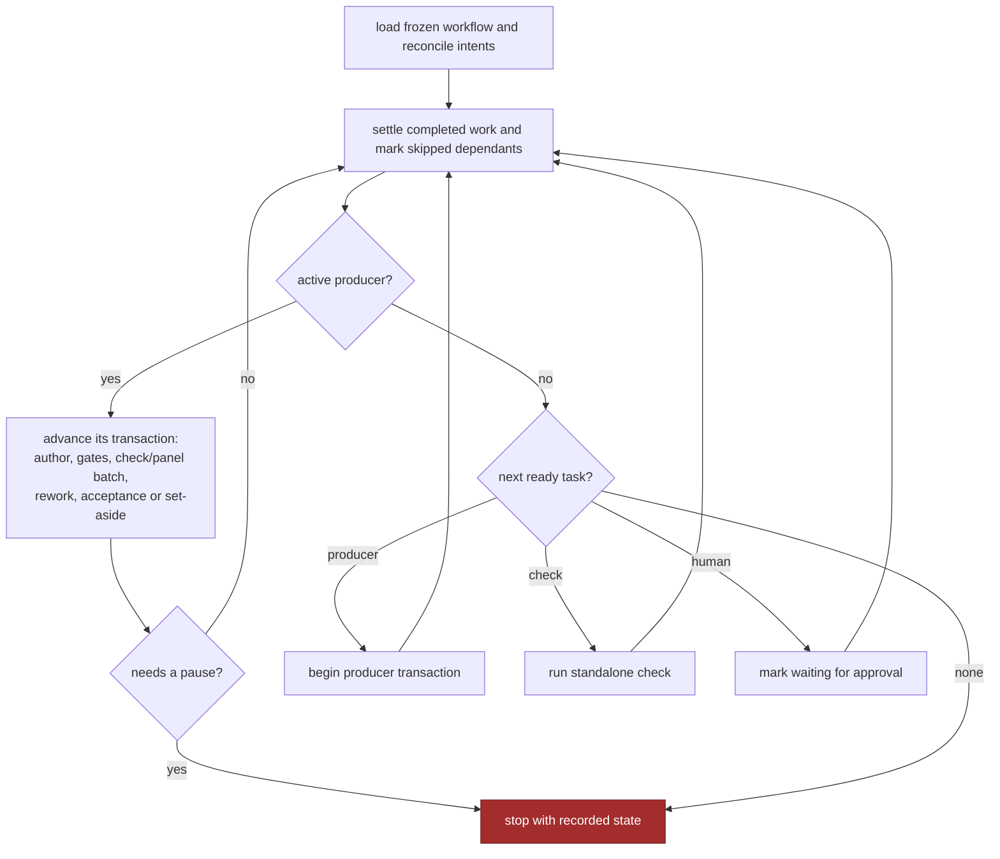
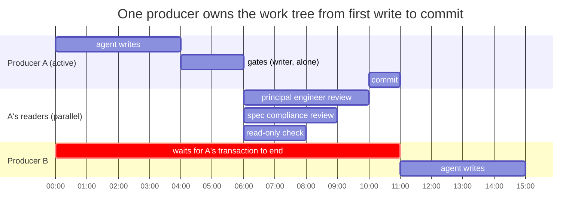
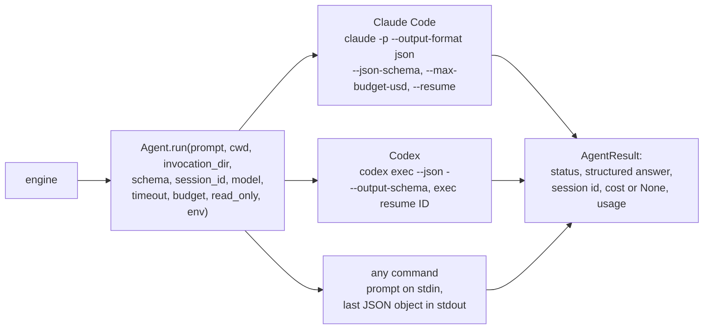
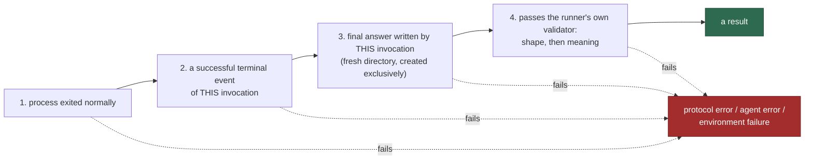

# 5 — Architecture

> [!NOTE]
> **Status: checked against stages 1–6 implementation and tests.** The
> [stage 5](../stage-5-walkthrough.md) and [stage 6](../stage-6-walkthrough.md)
> walkthroughs record executable panel and replan examples; live model checks are separate.

## The modules, and who is allowed to decide

Lifecycle decisions live in `engine` and its `panels` mixin. `findings` computes ledger transitions,
`budgets` reserves spending, and `replan` coordinates definition changes and reverts. Agent and
command adapters report observations. The pure ledger transitions and scripted execution tests
exercise decisions without paid model calls.

## The engine loop

Given the same workflow and the same results from agents, the same things happen in the same order.

## The producer transaction

Serial *processes* are not serial *transactions*. If producer A finished writing and independent
producer B started before A's panel ran, B would build on unaccepted work, and B's changes would
leak into A's review and A's commit. So the unit of exclusion is the whole life of a producer.

The hour marks illustrate ordering and overlap; they are not estimates of actual run time.

Inside a transaction, either **one writer** runs or a reader batch runs, never both. A batch
has at most `max_parallel` readers and completes before its results are applied in task order.
Standalone checks are sequential; concurrent readers belong to the active producer’s panel.

## Driving agents

One interface, three adapters. The runner never imports a model SDK; it starts command-line tools
in headless mode and reads what they print.

### What counts as a result

A call has succeeded only when **all four** hold:

A provider's schema feature makes valid answers likelier; it is never the check. A failing test
*inside* an agent's session is ordinary work, not a failed call. A sandbox that cannot start is an
**environment failure**: it stops the run and uses no attempt, because retrying the work cannot fix
the machine.

### Capabilities are qualified, not assumed

Answering a greeting proves nothing about reading files. `doctor` tests each agent profile per
capability, and every probe is judged by an **effect the runner observes itself**:

| Capability | Proof |
|---|---|
| `answer` | the exact expected object comes back |
| `read` | a random value that exists only in a scratch file appears in the answer |
| `execute` | a probe script writes a SHA-256 digest a model cannot compute without running it |
| `write` | the runner reads the expected change back |
| `resume` | a second call on the session id returns a value given only in the first |
| `boundary` | a sentinel file is unchanged after the agent was asked to modify it read-only |

Types state what they `require`; `doctor` and `start` refuse a workflow whose profiles fall short.
`validate` does not check this, so it works with no agent installed.

## Observability

`activity` routes native hook logs into each invocation. Codex exec events also pass through the
existing logger with an explicit `ExecStream.*` origin. `runner activity` reads these logs while
agents run. Observations do not decide acceptance. See [headless observability](../headless-observability.md).

## Prompts

Prompts are assembled deterministically, in **one pass over the template only**: substituted text
is never scanned again, so a diff containing `{rules}` or stray braces is harmless. Everything that
comes from a task, an agent or the repository is wrapped in a labelled data block, and the standing
rules distinguish the workflow task specification from repository and agent evidence; no block overrides runner boundaries. Prompts carry pointers and summaries, not
file contents; the agent reads the files itself.

## Limits

| Limit | Default | Enforced by |
|---|---|---|
| attempts per producer | 3 | engine |
| protocol retries per call | 2 | engine |
| time per agent call / per command | 30 min / 20 min | the runner's own clock; whole process group is stopped |
| money per call | $5 | the agent, where it can |
| money per run | $50 | engine, **by reservation** before each call |
| parallel readers | 4 | scheduler |

Reservation means four reviewers cannot each start a $5 call with $1 left. Spend is always reported
as three numbers, known, reserved and unpriced, because Codex reports tokens but no cost, and the
runner does not invent dollars.

---

| Previous | | Next |
|:--|:-:|--:|
| [4 — Safety: git, the record and recovery](04-safety-git-and-recovery.md) | [Contents](README.md) | [6 — Writing a workflow](06-writing-a-workflow.md) |

**Reference:** [05 — Architecture](../05-architecture.md).
