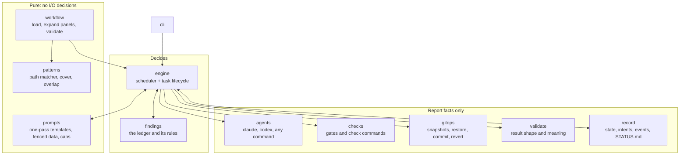
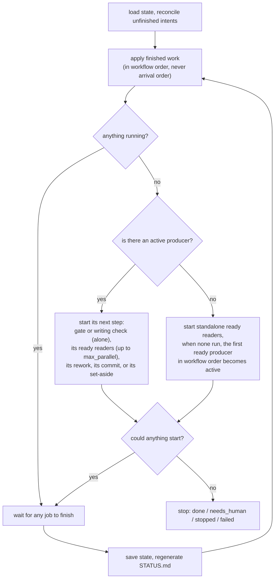
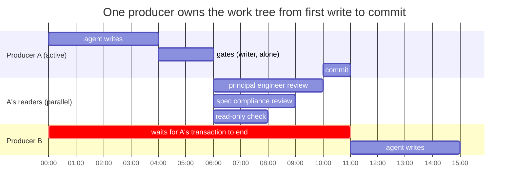
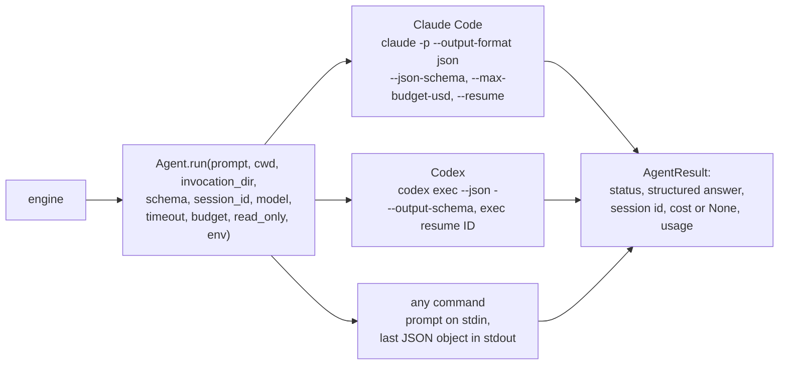
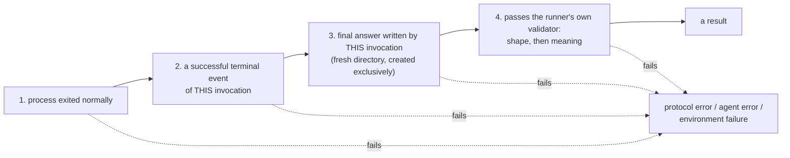

# 5 — Architecture

Status: **design, with the stage 3 subset implemented**. Producer transactions, gates, checks,
human decisions and the command adapter now run; panels, headless adapters and budgets remain
later-stage work. See the [verified CLI walkthrough](../stage-3-walkthrough.md).

## The modules, and who is allowed to decide

The design choice to notice: **only `engine` and `findings` decide anything**, and they decide only
from exit codes, validated answer fields, ledger status and counters. The modules that touch the
outside world report facts. That keeps the part that must be deterministic small and free of I/O,
so it can be tested exhaustively with a scripted agent and no model.

## The engine loop

Given the same workflow and the same results from agents, the same things happen in the same order.

## The producer transaction

Serial *processes* are not serial *transactions*. If producer A finished writing and independent
producer B started before A's panel ran, B would build on unaccepted work, and B's changes would
leak into A's review and A's commit. So the unit of exclusion is the whole life of a producer.

The hour marks illustrate ordering and overlap; they are not estimates of actual run time.

Inside a transaction, either **one writer** runs or **any number of readers** run, never both. This
is where the parallelism is: a five-person panel takes as long as its slowest member.

## Driving agents

One interface, three adapters. The runner never imports a model SDK; it starts command-line tools
in headless mode and reads what they print.

### What counts as a result

A call has succeeded only when **all four** hold:

A provider's schema feature makes valid answers likelier; it is never the check. A failing test
*inside* an agent's session is ordinary work, not a failed call. A sandbox that cannot start is an
**environment failure**: it stops the run and uses no attempt, because retrying the work cannot fix
the machine.

### Capabilities are qualified, not assumed

Answering a greeting proves nothing about reading files. `doctor` tests each agent profile per
capability, and every probe is judged by an **effect the runner observes itself**:

| Capability | Proof |
|---|---|
| `answer` | the exact expected object comes back |
| `read` | a random value that exists only in a scratch file appears in the answer |
| `execute` | a probe script writes a SHA-256 digest a model cannot compute without running it |
| `write` | the runner reads the expected change back |
| `resume` | a second call on the session id returns a value given only in the first |
| `boundary` | a sentinel file is unchanged after the agent was asked to modify it read-only |

Types state what they `require`; `doctor` and `start` refuse a workflow whose profiles fall short.
`validate` does not check this, so it works with no agent installed.

## Prompts

Prompts are assembled deterministically, in **one pass over the template only**: substituted text
is never scanned again, so a diff containing `{rules}` or stray braces is harmless. Everything that
comes from a task, an agent or the repository is wrapped in a labelled data block, and the standing
rules say such blocks are material, never instructions. Prompts carry pointers and summaries, not
file contents; the agent reads the files itself.

## Limits

| Limit | Default | Enforced by |
|---|---|---|
| attempts per producer | 3 | engine |
| protocol retries per call | 2 | engine |
| time per agent call / per command | 30 min / 20 min | the runner's own clock; whole process group is stopped |
| money per call | $5 | the agent, where it can |
| money per run | $50 | engine, **by reservation** before each call |
| parallel readers | 4 | scheduler |

Reservation means four reviewers cannot each start a $5 call with $1 left. Spend is always reported
as three numbers, known, reserved and unpriced, because Codex reports tokens but no cost, and the
runner does not invent dollars.

Next: [writing a workflow](06-writing-a-workflow.md).
Reference: [05 — Architecture](../05-architecture.md).
