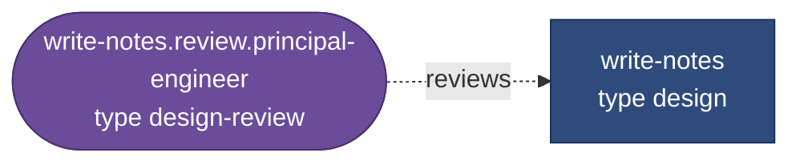
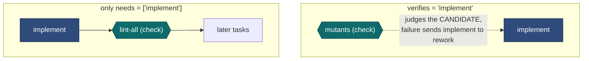

# 6 — Writing a workflow

> [!NOTE]
> **Status: verified at stage 1.** Both example workflows were run through `runner validate` and load;
> the quoted error messages for a missing verifier, an unknown key, a verifier that needs its target
> and an ignored output were produced by the program. The other rows of the table are covered by the
> stage 1 tests.

## The smallest useful workflow

```toml
name = "hello"

[[task]]
id = "write-notes"
type = "design"
prompt = "Write a one-page note on how the build works."
outputs = ["docs/notes/build.md"]
reviewers = ["principal-engineer"]
```

One producer, one reviewer. It loads because the producer has a verifier. Remove `reviewers` and it
is rejected: `task 'write-notes' has no gate, check, review or human verifier`.

What the runner makes of it:



The panel shorthand expanded into a review task. Its type came from the producer's type: `design`
names `design-review` as its `review_type`.

## A realistic chain

```toml
name = "book-module"
root = ".."                      # the repository, relative to this file

[defaults]
agent = "claude"
protected = ["docs/spec/**", "tests/fixtures/**"]

[[task]]
id = "design"
type = "design"
prompt_file = "briefs/book-design.md"        # relative to this file
outputs = ["docs/design/05-order-book.md"]
reviewers = ["principal-engineer", "spec-compliance"]

[[task]]
id = "tests"
type = "test"
needs = ["design"]
outputs = ["tests/book/**"]
gate = ["cmake --build build"]
reviewers = ["spec-compliance"]

[[task]]
id = "implement"
type = "implement"
needs = ["tests"]
outputs = ["src/book/**"]
writes = ["src/book/**", "CMakeLists.txt"]
gate = [
  "cmake --build build",
  { run = "ctest --test-dir build -R book", new = true, fail_pattern = "book" },
]
reviewers = ["principal-engineer", { perspective = "devops", advisory = true }]

[[task]]
id = "signoff"
type = "human"
needs = ["implement"]
```

Things to notice:

- **`tests` comes before `implement` and is accepted first**, so `tests/book/**` is frozen when the
  implementer runs. The author cannot edit the tests to make them pass.
- **`outputs` versus `writes`.** Outputs are the deliverables: what downstream tasks are pointed
  at and what is frozen. `writes` is everything the task may touch. `CMakeLists.txt` is a helper,
  not a deliverable.
- **A `new` gate** claims to prove this task's behaviour, so it must *fail before* the task is
  done, and for the right reason: `fail_pattern` is a regular expression the failing output must
  match. A plain-string gate is an invariant: it may pass all along; its job is to stay green.

## Path patterns

One matcher is used for `outputs`, `writes`, `removes` and `protected`.

| Pattern | Matches | Does not match |
|---|---|---|
| `src/book/side.hpp` | that file | anything else |
| `docs/spec/*` | `docs/spec/x.md` | `docs/spec/a/b.md` (`*` never crosses `/`) |
| `docs/spec/**` | `docs/spec/x.md`, `docs/spec/a/b.md` | `docs/spec` itself |
| `src/**/x.h` | `src/x.h`, `src/a/b/x.h` | `src/x.hpp` |
| `*.lock` | `x.lock`, `sub/dir/x.lock` | |

## Standalone steps and verifying steps

A `check` or `human` task is one of two things, depending on one key:



A verifying task must **not** also list its target in `needs`: the target's acceptance would wait
for a verifier that waits for the target's acceptance. `validate` rejects that, and the indirect
version of it, with the dependency trace.

A standalone check that fails is `failed`; there is no author to send it back to.

## What `validate` catches

Run it after every edit. It needs no agent and spends nothing, reports every problem at once, and
then prints the expanded DAG in execution order.

| Mistake | Message (example) |
|---|---|
| A typo in a key | `task 'design': unknown key 'ouputs'` |
| A producer nobody checks | `task 'design' has no gate, check, review or human verifier` |
| A dependency cycle | `dependency cycle: a -> b -> a` |
| A verifier that can never run | `acceptance cycle: a -> m -> a: 'm' verifies 'a' and also needs it: 'a' can never be accepted` |
| Two unordered tasks writing the same place | `'extend' and 'implement' both write src/book/** and neither depends on the other` |
| An output git cannot see | `'implement' output build/config.h is ignored by .gitignore:1 'build/'` |
| An output not covered by `writes` | asks for the entry to be repeated in `writes` |
| Two personas with one finding-id prefix | `personas 'security' and 'spec-compliance' both use code 'SC'` |

It also **warns**, without failing, when a later task claims a frozen file, when a task may edit a
file its own gate executes, and when an agent profile bypasses its sandbox.

## Adding a type or a persona

Both are TOML files in a library directory; a workflow adds its own with `library = ["lib"]`.

A persona is mostly three lists:

```toml
name = "security"
code = "SEC"                         # prefix of its finding ids; unique across the library
title = "Security reviewer"
focus = ["input validation at trust boundaries", "secrets in code or logs"]
blocking = ["a memory-safety defect reachable from network input"]
out_of_scope = ["naming and style", "build configuration: the devops reviewer covers it"]
```

Spend the effort on `blocking` and `out_of_scope`. A persona that blocks on taste makes panels
never converge; one without an out-of-scope list repeats what the others say.

---

| Previous | | Next |
|:--|:-:|--:|
| [5 — Architecture](05-architecture.md) | [Contents](README.md) | [Runbook](../runbook.md) |

**Reference:** [03 — Workflow file](../03-workflow-file.md), [library/README](../../library/README.md).
