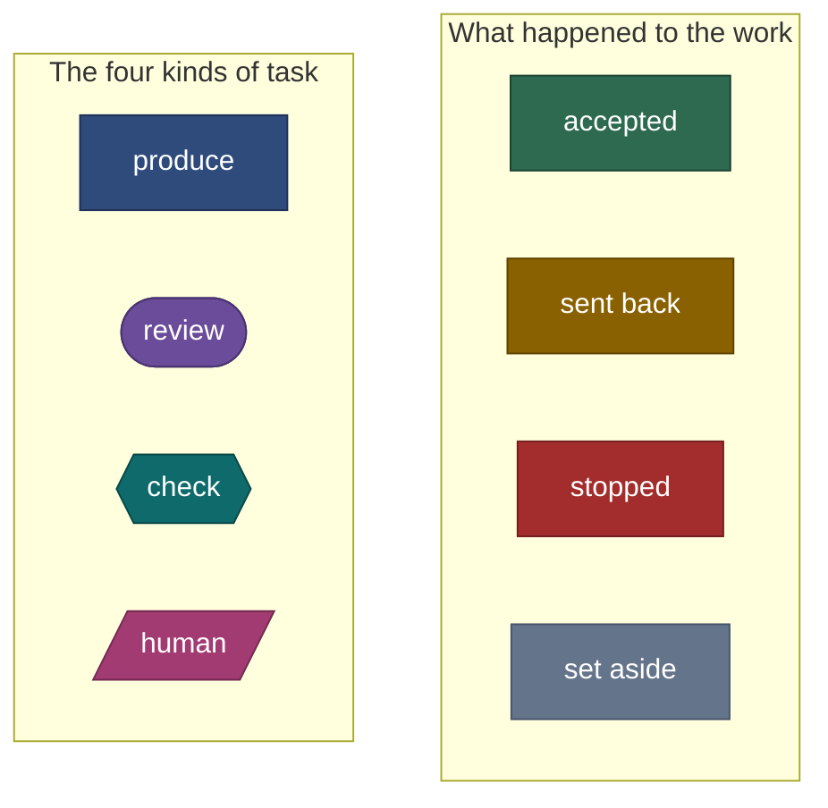

# Task runner tutorial

A guided tour of the task runner: what it is for, how a task moves through it, why it is built the
way it is, and how to write a workflow. It is written for someone who has not read the design
documents. Those remain the reference; this tutorial explains them and links to them.

## Chapters

| # | Chapter | You learn | Status |
|--:|---|---|---|
| 1 | [The idea](01-the-idea.md) | What problem this solves, and the five rules everything follows from | checked against stages 1–6 |
| 2 | [A task, end to end](02-a-task-end-to-end.md) | The life of one producer: attempt, checks, review, commit | checked against stages 1–6 |
| 3 | [Review panels and findings](03-review-panels-and-findings.md) | How several reviewers converge instead of looping forever | checked against stages 1–6 |
| 4 | [Safety: git, the record and recovery](04-safety-git-and-recovery.md) | Why a crash, a bad agent or a bad gate cannot corrupt your repository | partly verified at stage 6 |
| 5 | [Architecture](05-architecture.md) | The modules, who decides what, how agents are driven | checked against stages 1–6 |
| 6 | [Writing a workflow](06-writing-a-workflow.md) | The file format by example, and the mistakes `validate` catches | verified at stage 1 |
| | [Runbook](../runbook.md) | Operating a run: commands, stops, recovery | partly verified at stage 6 |

Chapters 1 to 3 are enough to understand what a run does. Chapter 4 is for anyone who needs to
trust it. Chapter 5 is for anyone who will change it. Chapter 6 and the runbook are for daily use.

Each chapter opens with a note that says how far it has been checked:

| Status | Meaning |
|---|---|
| **design** | Written from the design documents. Not yet checked against code |
| **verified at stage N** | Commands were run, and diagrams compared with the program, at that stage of the [plan](../07-implementation-plan.md) |

## How to read the diagrams

Diagrams are [Mermaid](https://mermaid.js.org/); GitHub renders them in place. Shape and colour
mean the same thing in every chapter. A box with no colour is a plain step.

| Colour | Used for |
|---|---|
| Blue, violet, teal, rose | A task of kind `produce`, `review`, `check`, `human`. Rose also marks any point where a person decides |
| Green | Work that was accepted, or an action that is allowed |
| Ochre | Work sent back to its author, or a finding that still blocks |
| Red | The run stops, or the task ends as `failed` or `blocked` |
| Grey | Closed with nothing more to do: `skipped`, `noted`, `superseded` |

New diagrams should copy their `classDef` lines from the one above.

## Words used throughout

| Word | Meaning |
|---|---|
| **workflow** | A TOML file: tasks joined by `needs` into a graph with no cycles |
| **run** | One execution of a workflow. It has a UUID, a directory and a git branch |
| **producer** | A task that changes files. Everything else checks producers |
| **verifier** | A gate, a `check` task, a `review` task or a `human` task |
| **candidate** | What a producer's attempt left in the work tree, identified by a git tree id |
| **accepted** | Every verifier passed on one unchanged candidate. It is committed and frozen |
| **finding** | One piece of review feedback, tracked by id until it is settled |
| **the record** | The run directory: everything that happened, kept in a fixed layout |
